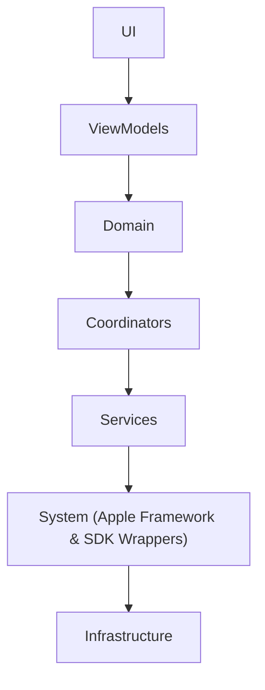
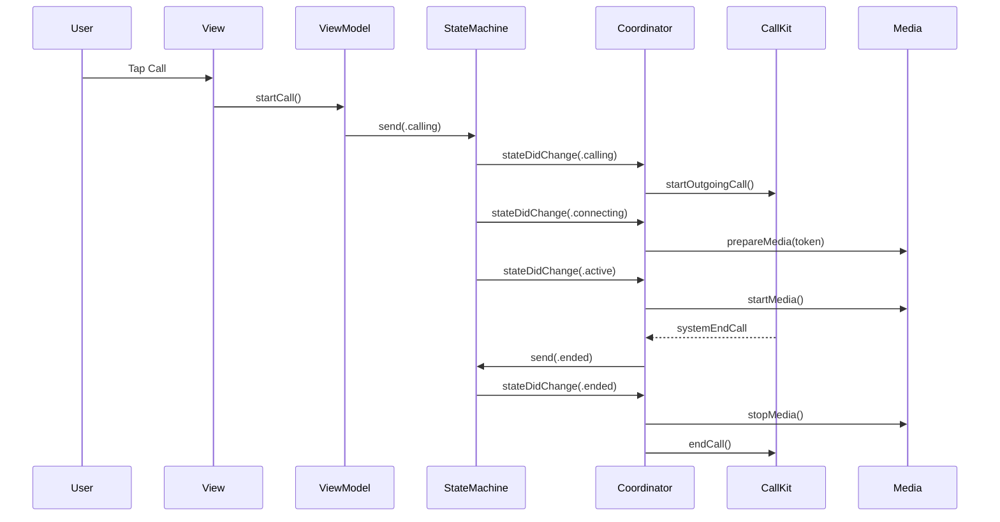

# SwiftCallKit

SwiftCallKit is a production-grade iOS reference project showcasing a **state-driven CallKit architecture**
built with **SwiftUI**, **Combine**, and **Coordinator-based MVVM**, and developed using **Test-Driven Development**.

The project focuses on explicit state management, side-effect isolation, and testability, reflecting
real-world iOS platform engineering practices rather than feature-driven implementation.

---

## Goals

- Demonstrate senior-level iOS architecture suitable for large, long-lived codebases
- Showcase correct isolation of Apple system frameworks (CallKit)
- Integrate a WebRTC media layer using LiveKit, isolated behind protocol-based abstractions
- Provide a clean MVVM + Coordinator reference implementation
- Enable unit testing of business logic and navigation flows
- Reflect real-world engineering practices used in production fintech apps

---

## Architecture Overview

The application follows a **strict layered architecture**:

## Architecture Diagram

## Call Lifecycle & Coordinator Flow

### Core Principles

- **Views** render UI only
- **ViewModels** expose user intent and observe domain state
- **Domain** owns business rules and the call state machine
- **Coordinators** react to state changes and orchestrate side effects
- **Services** provide protocol-based capabilities (media, tokens, system access)
- **System** wraps Apple frameworks and third-party SDKs (CallKit, AVAudioSession, LiveKit)
- **Infrastructure** constructs and wires dependencies

This separation ensures that no UI code depends directly on system frameworks,
all side effects are centralized, and all business logic remains testable and deterministic.

---

## Testing Strategy

This project is developed using TDD.

- **Domain** is tested in isolation (pure state machine tests)
- **Coordinators** are unit tested by asserting side effects
- **System frameworks** (CallKit, LiveKit) are fully mocked
- Async behavior is tested deterministically using structured concurrency

No Apple system APIs are exercised in tests.

## Reactive & Async Strategy

- **Combine** is used for state observation and UI binding
- **async/await** is used for one-shot side effects (token fetch, media setup)
- The two models are intentionally kept separate to avoid complexity

This mirrors real-world iOS platform practices.

