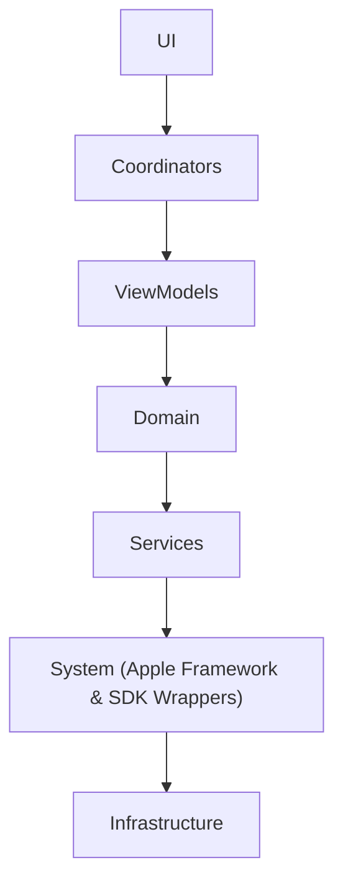

# SwiftCallKit

SwiftCallKit is a production-grade reference iOS application demonstrating how to build
audio and video calling features using **CallKit**, **SwiftUI**, and a **Coordinator-driven MVVM architecture**.

This project is intentionally designed as an **architecture-first system**, focusing on
scalability, testability, and clean separation of concerns rather than feature quantity.

---

## Goals

- Demonstrate senior-level iOS architecture suitable for large, long-lived codebases
- Showcase correct isolation of Apple system frameworks (CallKit, AVAudioSession)
- Integrate a WebRTC media layer using LiveKit, isolated behind protocol-based abstractions
- Provide a clean MVVM + Coordinator reference implementation
- Enable unit testing of business logic and navigation flows
- Reflect real-world engineering practices used in production fintech apps

---

## Architecture Overview

The application follows a **strict layered architecture**:

## Architecture Diagram

### Core Principles

- **Views** render UI only
- **ViewModels** manage state and expose intent
- **Coordinators** own navigation and application flow
- **Domain** contains business rules and state machines
- **Services** orchestrate use cases
- **System** wraps Apple frameworks and third-party SDKs (CallKit, AVAudioSession, LiveKit)
- **Infrastructure** constructs and wires dependencies

This separation ensures that no UI code depends directly on system frameworks
and that all business logic remains testable and isolated.

---

